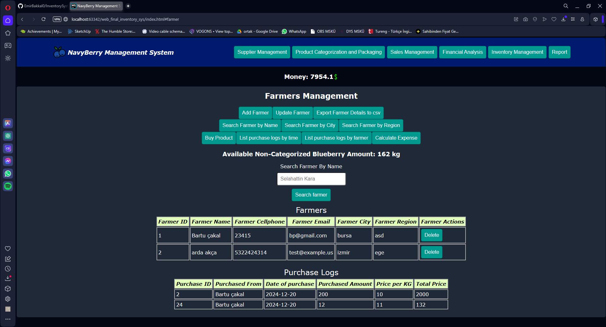
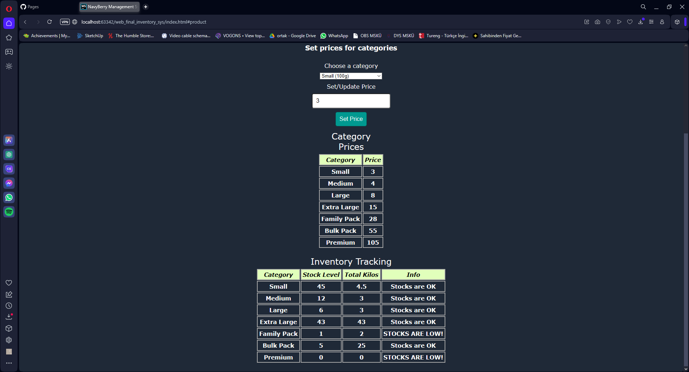
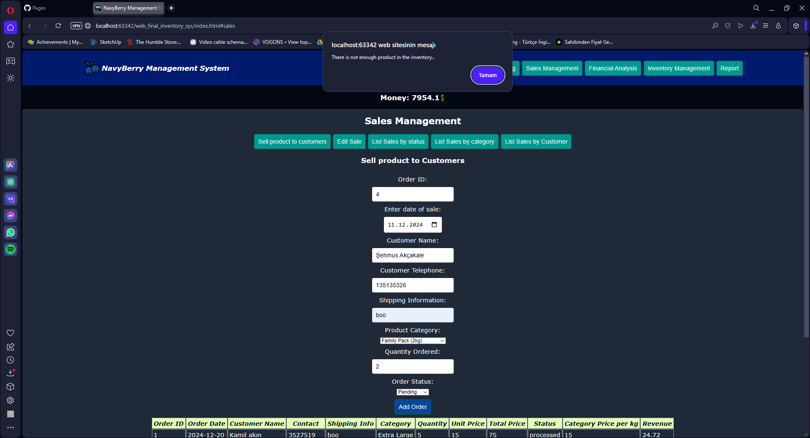
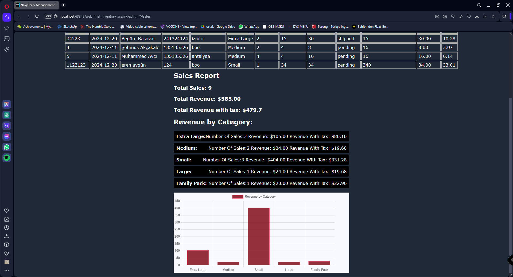
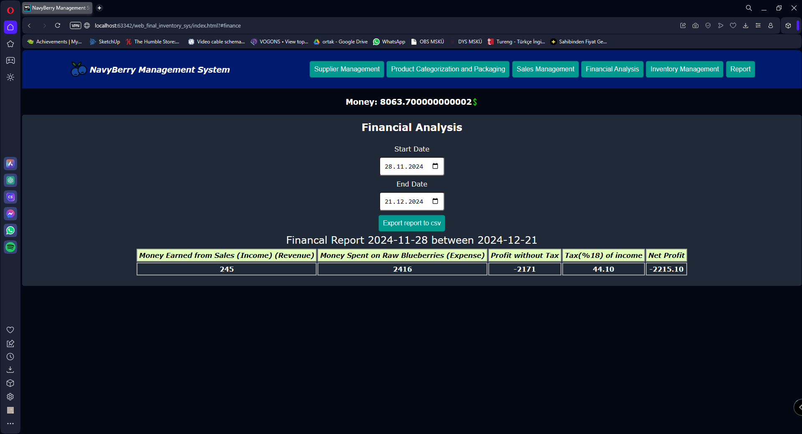
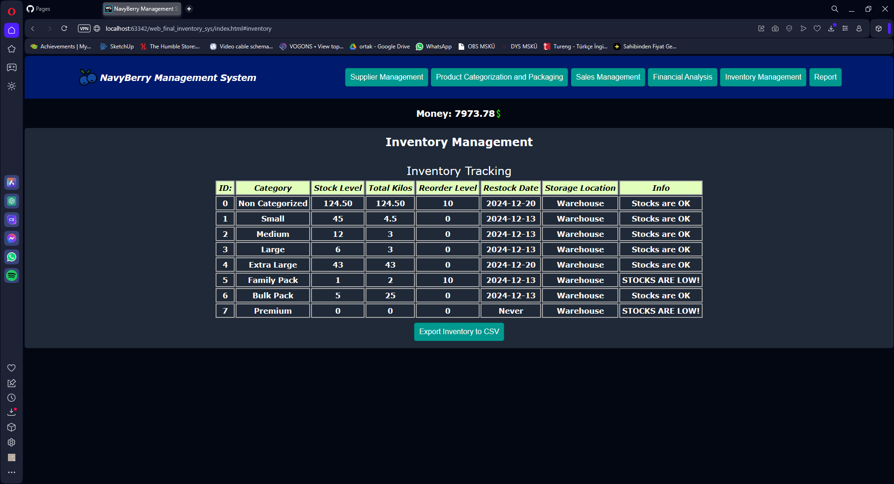
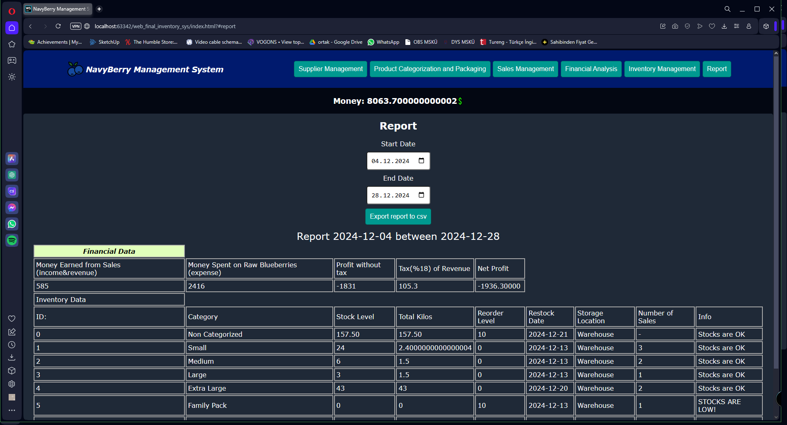

Live Link:https://emirbakkal0.github.io/InventorySystemwithJS-webFinal/

This project will create a web-based management system for a factory that buys blueberries from
farmers, categorizes and packages them, and sells them to customers. The system will enable the
factory to track blueberry purchases, categorize blueberries into various package sizes with distinct
pricing, and record sales transactions. The application will also provide detailed financial
calculations, including income, expenses, taxes, and inventory tracking

